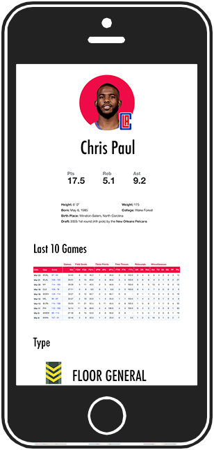
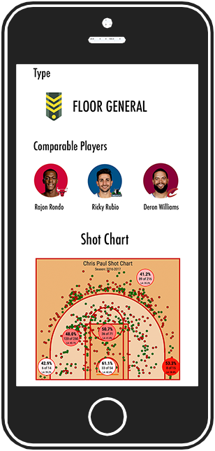

______
# UPDATE (3/3/2021)
Please be aware this is a deprecated project, containing code that may not work without necessary changes. Please use this repository as inspiration or a launchpad for your own code and project. 
__________

# The 8 Types of NBA Players
## Using machine learning to classify NBA players

#### By Alex Cheng

For more information, please check out the Medium article at [Fastbreak Data](https://fastbreakdata.com/classifying-the-modern-nba-player-with-machine-learning-539da03bb824#.dutxn9ia9). 

### Description

The traditional five player positions incorrectly oversimplify the skill sets of NBA players. Simply pigeon-holing players into one of five positions does not accurately define a player’s specific skill set.

Coaches and scouts in the NBA already recognize players as having skills that exceed their predefined positions and have even come up with alternative position names to describe players such as the combo guard (i.e. a player that combines the attributes of a point guard and shooting guard) or the swingman (i.e. a player that can play both the shooting guard and small forward positions).

Using machine learning, my goal is to uncover the positions that are intrinsic to today’s NBA players and classify players with a position that best encapsulates their skill sets.

### Data

Source: [Basketball-Reference.com](www.basketball-reference.com)

### Methods
1. Data Acquistion with Selenium
2. Dimensionality Reduction with Linear Discriminant Analysis
3. Cluster the Data with KMeans Clustering
4. Feature Extraction with Principal Component Analysis
5. Data Visualization with Tableau

### Player Types

- Floor General
- Combo Guard
- Offensive Wing
- Shooting Wing
- 3-and-D Wing
- Versatile Forward
- Offensive Forward
- Defensive Center

### Implementation

One suggestion for implementing the results of this project would be in player scouting. Each team already understands the strengths and weaknesses of their own players, but scouting opposing players in the midst of a season becomes a challenge. 

With player types and shot charts, teams can quickly learn the characteristics of opposing players and can see which spots on the court opposing players are most effective. The images below are mock-ups of how player types can be used for scouting.

---

